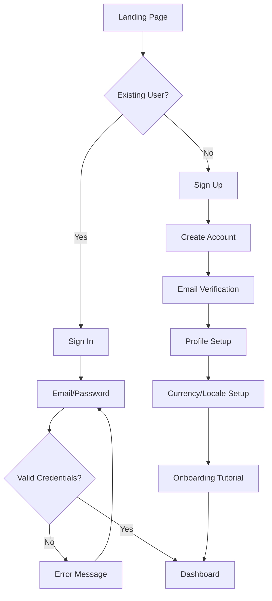
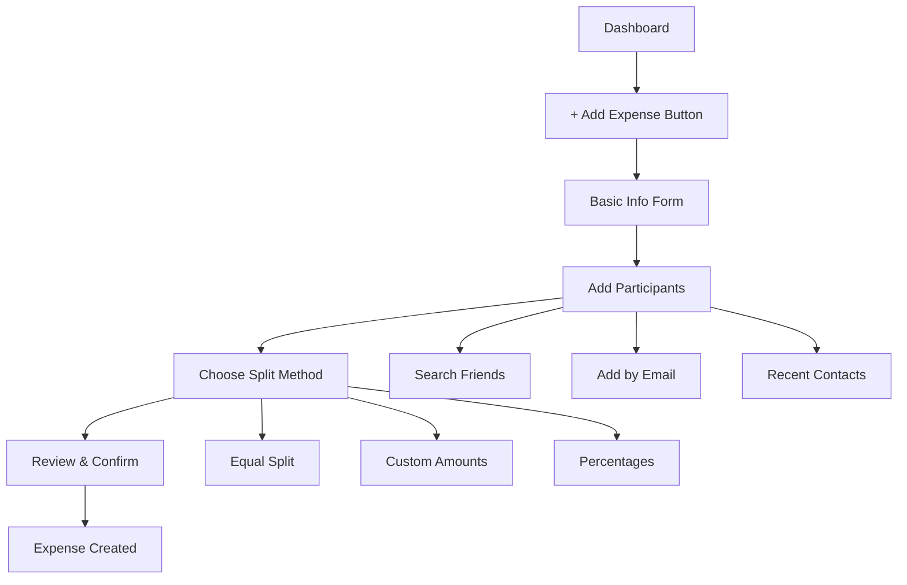

# UX/UI Specifications & User Flows

**Version:** 2.0  
**Last Updated:** September 17, 2025

## 🎨 Design System Overview

### Design Principles

1. **Mobile-First**: Optimized for smartphone usage with responsive desktop support
2. **Clarity**: Financial information must be immediately clear and unambiguous  
3. **Trust**: Visual design builds confidence in financial transactions
4. **Efficiency**: Minimize steps for common actions like splitting bills
5. **Accessibility**: WCAG 2.1 AA compliance for inclusive design

### Color Palette

```css
:root {
  /* Primary Colors */
  --primary-500: #3B82F6;    /* Blue - primary actions */
  --primary-600: #2563EB;    /* Blue - hover states */
  --primary-700: #1D4ED8;    /* Blue - active states */
  
  /* Success/Money Colors */
  --success-500: #10B981;    /* Green - positive amounts, settlements */
  --success-600: #059669;    /* Green - hover */
  
  /* Warning/Debt Colors */  
  --warning-500: #F59E0B;    /* Amber - pending payments */
  --warning-600: #D97706;    /* Amber - hover */
  
  /* Error/Negative Colors */
  --error-500: #EF4444;      /* Red - debts, errors */
  --error-600: #DC2626;      /* Red - hover */
  
  /* Neutral Colors */
  --gray-50: #F9FAFB;        /* Light backgrounds */
  --gray-100: #F3F4F6;       /* Card backgrounds */
  --gray-200: #E5E7EB;       /* Borders */
  --gray-500: #6B7280;       /* Secondary text */
  --gray-700: #374151;       /* Primary text */
  --gray-900: #111827;       /* Headers */
}
```

### Typography Scale

```css
/* Font Family */
--font-primary: 'Inter', system-ui, sans-serif;
--font-mono: 'JetBrains Mono', 'Fira Code', monospace;

/* Font Sizes */
--text-xs: 0.75rem;    /* 12px - captions */
--text-sm: 0.875rem;   /* 14px - body text */
--text-base: 1rem;     /* 16px - default */
--text-lg: 1.125rem;   /* 18px - emphasis */
--text-xl: 1.25rem;    /* 20px - small headers */
--text-2xl: 1.5rem;    /* 24px - headers */
--text-3xl: 1.875rem;  /* 30px - page titles */

/* Font Weights */
--font-normal: 400;
--font-medium: 500;
--font-semibold: 600;
--font-bold: 700;
```

---

## 📱 Core User Flows

### 1. User Onboarding Flow



**Screen Details:**

**Landing Page**
- Hero section with value proposition
- "Split expenses with friends" tagline
- Sign In / Sign Up buttons
- Feature highlights with screenshots

**Sign Up Flow**
```typescript
interface SignUpForm {
  email: string;
  password: string;
  confirmPassword: string;
  displayName: string;
  agreeToTerms: boolean;
}

// Validation rules
const signUpValidation = {
  email: 'Valid email required',
  password: 'Minimum 8 characters, 1 uppercase, 1 lowercase, 1 number',
  displayName: 'Minimum 2 characters, maximum 50'
}
```

**Profile Setup**
- Upload profile photo (optional)
- Select preferred currency from dropdown
- Choose locale/timezone (auto-detected)
- Privacy settings (searchable by others)

### 2. Expense Creation Flow



**Screen Mockups:**

**Basic Info Form**
```
┌─────────────────────────────────┐
│ ← Create Expense                │
├─────────────────────────────────┤
│ Description *                   │
│ ┌─────────────────────────────┐ │
│ │ Dinner at Tony's Pizza     │ │
│ └─────────────────────────────┘ │
│                                 │
│ Amount *                        │
│ ┌──┐ ┌─────────────────────────┐ │
│ │$│ │ 85.50                  │ │
│ └──┘ └─────────────────────────┘ │
│                                 │
│ Category                        │
│ ┌─────────────────────────────┐ │
│ │ 🍽️ Restaurants           ▼ │ │
│ └─────────────────────────────┘ │
│                                 │
│ 📷 Add Receipt (Optional)       │
│                                 │
│ [ Next: Add People ]            │
└─────────────────────────────────┘
```

**Add Participants Screen**
```
┌─────────────────────────────────┐
│ ← Add People                    │
├─────────────────────────────────┤
│ Who shared this expense?        │
│                                 │
│ ┌─────────────────────────────┐ │
│ │ 🔍 Search friends or email │ │
│ └─────────────────────────────┘ │
│                                 │
│ ✓ You (Creator)                │ 
│ ┌─────────────────────────────┐ │
│ │ + Alice Johnson            │ │
│ │   alice@email.com          │ │
│ │                      [ × ] │ │
│ └─────────────────────────────┘ │
│ ┌─────────────────────────────┐ │
│ │ + Bob Smith                │ │
│ │   bob@email.com            │ │
│ │                      [ × ] │ │
│ └─────────────────────────────┘ │
│                                 │
│ Recent Contacts                 │
│ Charlie • Dana • Mike          │
│                                 │
│ [ Next: Split Amount ]          │
└─────────────────────────────────┘
```

**Split Method Selection**
```
┌─────────────────────────────────┐
│ ← How to Split $85.50?          │
├─────────────────────────────────┤
│ ⚡ Equal Split (Recommended)    │
│ ┌─────────────────────────────┐ │
│ │ You      $28.50            │ │
│ │ Alice    $28.50            │ │  
│ │ Bob      $28.50            │ │
│ └─────────────────────────────┘ │
│                                 │
│ ⚙️ Custom Amounts               │
│ ┌─────────────────────────────┐ │
│ │ Set exact amount per person │ │
│ └─────────────────────────────┘ │
│                                 │
│ % Percentages                   │
│ ┌─────────────────────────────┐ │
│ │ Set percentage per person   │ │
│ └─────────────────────────────┘ │
│                                 │
│ [ Create Expense ]              │
└─────────────────────────────────┘
```

### 3. Settlement Flow

```mermaid
flowchart TD
    A[Debt List] --> B[Select Debt]
    B --> C[Mark as Paid]
    C --> D[Enter Payment Details]
    D --> E[Add Proof (Optional)]
    E --> F{Auto-Confirm Mode?}
    F -->|Yes| G[Settlement Complete]
    F -->|No| H[Waiting for Confirmation]
    H --> I[Creditor Reviews]
    I --> J{Approved?}
    J -->|Yes| G
    J -->|No| K[Dispute Resolution]
```

**Settlement Screen**
```
┌─────────────────────────────────┐
│ ← Settle with Alice             │
├─────────────────────────────────┤
│ 🍽️ Dinner at Tony's Pizza       │
│ You owe: $28.50                │
│                                 │
│ Payment Amount                  │
│ ┌──┐ ┌─────────────────────────┐ │
│ │$│ │ 28.50                  │ │
│ └──┘ └─────────────────────────┘ │
│                                 │
│ Payment Method                  │
│ ┌─────────────────────────────┐ │
│ │ 💳 Venmo                  ▼ │ │
│ └─────────────────────────────┘ │
│                                 │
│ Payment Reference (Optional)    │
│ ┌─────────────────────────────┐ │
│ │ Venmo transaction ID       │ │
│ └─────────────────────────────┘ │
│                                 │
│ 📷 Add Proof of Payment         │
│ [ + Take Photo ]                │
│                                 │
│ Notes (Optional)                │
│ ┌─────────────────────────────┐ │
│ │ Thanks for dinner!         │ │
│ └─────────────────────────────┘ │
│                                 │
│ [ Mark as Paid ]                │
└─────────────────────────────────┘
```

### 4. Dashboard Overview

**Main Dashboard Layout**
```
┌─────────────────────────────────┐
│ ☰ Expense Flow         👤 [JD] │
├─────────────────────────────────┤
│ 💰 Your Balance                │
│ ┌─────────────────────────────┐ │
│ │ You owe: $125.50           │ │
│ │ You're owed: $87.25        │ │
│ │ Net: -$38.25               │ │
│ └─────────────────────────────┘ │
│                                 │
│ 🎯 Quick Actions               │
│ [+ Add Expense] [💸 Settle Up] │
│                                 │
│ 📊 Recent Activity             │
│ ┌─────────────────────────────┐ │
│ │ 🍕 Pizza Night             │ │
│ │ You owe Alice $15.50       │ │
│ │ 2 hours ago                │ │
│ └─────────────────────────────┘ │
│ ┌─────────────────────────────┐ │
│ │ ✅ Gas Money               │ │
│ │ Bob paid you $25.00        │ │
│ │ Yesterday                  │ │
│ └─────────────────────────────┘ │
│                                 │
│ [ See All Activity ]            │
│                                 │
│ ⚡ Quick Settle                 │
│ Alice Johnson        [ Pay ] │ │
│ You owe $43.75               │ │
│                                 │
│ Bob Smith           [ Request] │ │
│ Owes you $25.00              │ │
└─────────────────────────────────┘
```

---

## 🎯 Responsive Design Specifications

### Breakpoints

```css
/* Mobile First Approach */
:root {
  --mobile: 0px;        /* 0-640px */
  --tablet: 640px;      /* 640-1024px */
  --desktop: 1024px;    /* 1024px+ */
}

/* Layout Grid */
.container {
  padding: 0 1rem;      /* Mobile: 16px sides */
  max-width: 1200px;
  margin: 0 auto;
}

@media (min-width: 640px) {
  .container {
    padding: 0 2rem;    /* Tablet: 32px sides */
  }
}

@media (min-width: 1024px) {
  .container {
    padding: 0 3rem;    /* Desktop: 48px sides */
  }
}
```

### Mobile Navigation

**Bottom Tab Navigation (Mobile)**
```
┌─────────────────────────────────┐
│                                 │
│        Main Content Area        │
│                                 │
├─────────────────────────────────┤
│ 🏠    💰    +    📊    👤    │
│Home  Debts Create Stats Profile │
└─────────────────────────────────┘
```

**Desktop Sidebar Navigation**
```
┌────────┬─────────────────────────┐
│ 🏠 Home│                        │
│ 💰 Debts│      Main Content      │
│ 📊 Stats│                        │
│ 👥 Friends│                     │
│ ⚙️ Settings│                    │
│        │                        │
│ 👤 Profile│                     │
└────────┴─────────────────────────┘
```

---

## ⚡ Interaction Patterns

### 1. Progressive Enhancement

**Expense Amount Input**
```typescript
// Enhanced input with formatting
const AmountInput: React.FC = () => {
  const [value, setValue] = useState('');
  const [formatted, setFormatted] = useState('');
  
  const handleChange = (input: string) => {
    // Remove non-numeric characters
    const numeric = input.replace(/[^\d.]/g, '');
    setValue(numeric);
    
    // Format for display
    if (numeric) {
      setFormatted(new Intl.NumberFormat('en-US', {
        style: 'currency',
        currency: 'USD'
      }).format(parseFloat(numeric)));
    }
  };
  
  return (
    <div className="relative">
      <span className="absolute left-3 text-gray-500">$</span>
      <input
        type="text"
        value={value}
        onChange={(e) => handleChange(e.target.value)}
        placeholder="0.00"
        className="pl-8 pr-4 py-3 border rounded-lg"
      />
      {formatted && (
        <div className="text-sm text-gray-600 mt-1">
          {formatted}
        </div>
      )}
    </div>
  );
};
```

### 2. Smart Suggestions

**Participant Autocomplete**
```typescript
interface ParticipantSuggestion {
  type: 'friend' | 'recent' | 'search';
  user: {
    id: string;
    name: string;
    email: string;
    photoURL?: string;
  };
  frequency?: number; // For sorting recent contacts
}

const ParticipantInput: React.FC = () => {
  const [query, setQuery] = useState('');
  const [suggestions, setSuggestions] = useState<ParticipantSuggestion[]>([]);
  
  useEffect(() => {
    if (query.length >= 2) {
      // Combine friends, recent contacts, and search results
      const fetchSuggestions = async () => {
        const [friends, recent, search] = await Promise.all([
          getFriends(query),
          getRecentContacts(query),
          searchUsers(query)
        ]);
        
        setSuggestions([
          ...friends.map(f => ({ type: 'friend', user: f })),
          ...recent.map(r => ({ type: 'recent', user: r, frequency: r.frequency })),
          ...search.map(s => ({ type: 'search', user: s }))
        ]);
      };
      
      fetchSuggestions();
    }
  }, [query]);
  
  return (
    <div className="relative">
      <input
        type="text"
        value={query}
        onChange={(e) => setQuery(e.target.value)}
        placeholder="Search friends or enter email"
        className="w-full p-3 border rounded-lg"
      />
      
      {suggestions.length > 0 && (
        <div className="absolute top-full left-0 right-0 bg-white border border-t-0 rounded-b-lg shadow-lg z-10">
          {suggestions.map((suggestion, index) => (
            <ParticipantSuggestionItem
              key={`${suggestion.type}-${suggestion.user.id}-${index}`}
              suggestion={suggestion}
              onSelect={addParticipant}
            />
          ))}
        </div>
      )}
    </div>
  );
};
```

### 3. Optimistic Updates

**Settlement Processing**
```typescript
const useOptimisticSettlement = () => {
  const [settlements, setSettlements] = useState<Settlement[]>([]);
  
  const markAsPaid = async (debtId: string, amount: number) => {
    // Optimistic update
    const optimisticSettlement: Settlement = {
      id: `temp-${Date.now()}`,
      debtId,
      amount,
      status: 'pending',
      createdAt: new Date().toISOString(),
      // ... other fields
    };
    
    setSettlements(prev => [...prev, optimisticSettlement]);
    
    try {
      // Send to server
      const settlement = await createSettlement({ debtId, amount });
      
      // Replace optimistic with real data
      setSettlements(prev => 
        prev.map(s => 
          s.id === optimisticSettlement.id ? settlement : s
        )
      );
    } catch (error) {
      // Rollback on error
      setSettlements(prev => 
        prev.filter(s => s.id !== optimisticSettlement.id)
      );
      
      // Show error message
      toast.error('Failed to process settlement. Please try again.');
    }
  };
  
  return { settlements, markAsPaid };
};
```

---

## ♿ Accessibility Guidelines

### 1. Keyboard Navigation

```typescript
// Focus management for modal dialogs
const ExpenseModal: React.FC = ({ isOpen, onClose }) => {
  const firstInputRef = useRef<HTMLInputElement>(null);
  const modalRef = useRef<HTMLDivElement>(null);
  
  useEffect(() => {
    if (isOpen) {
      // Focus first input when modal opens
      firstInputRef.current?.focus();
      
      // Trap focus within modal
      const handleKeyDown = (e: KeyboardEvent) => {
        if (e.key === 'Escape') {
          onClose();
        }
        
        if (e.key === 'Tab') {
          const focusableElements = modalRef.current?.querySelectorAll(
            'button, [href], input, select, textarea, [tabindex]:not([tabindex="-1"])'
          );
          
          if (focusableElements) {
            const firstElement = focusableElements[0] as HTMLElement;
            const lastElement = focusableElements[focusableElements.length - 1] as HTMLElement;
            
            if (e.shiftKey && document.activeElement === firstElement) {
              e.preventDefault();
              lastElement.focus();
            } else if (!e.shiftKey && document.activeElement === lastElement) {
              e.preventDefault();
              firstElement.focus();
            }
          }
        }
      };
      
      document.addEventListener('keydown', handleKeyDown);
      return () => document.removeEventListener('keydown', handleKeyDown);
    }
  }, [isOpen, onClose]);
  
  return (
    <div
      ref={modalRef}
      role="dialog"
      aria-modal="true"
      aria-labelledby="modal-title"
      className="modal"
    >
      <h2 id="modal-title">Create New Expense</h2>
      <input
        ref={firstInputRef}
        type="text"
        aria-label="Expense description"
        placeholder="What was this expense for?"
      />
      {/* ... rest of modal content */}
    </div>
  );
};
```

### 2. Screen Reader Support

```typescript
// Semantic markup for expense list
const ExpenseList: React.FC = ({ expenses }) => {
  return (
    <section aria-labelledby="expenses-heading">
      <h2 id="expenses-heading">Your Expenses</h2>
      
      <ul role="list" aria-label="List of expenses">
        {expenses.map(expense => (
          <li key={expense.id} role="listitem">
            <article
              aria-labelledby={`expense-${expense.id}-title`}
              aria-describedby={`expense-${expense.id}-details`}
            >
              <h3 id={`expense-${expense.id}-title`}>
                {expense.description}
              </h3>
              
              <div id={`expense-${expense.id}-details`}>
                <span aria-label={`Amount: ${formatCurrency(expense.amount)}`}>
                  {formatCurrency(expense.amount)}
                </span>
                
                <span aria-label={`Created on ${formatDate(expense.createdAt)}`}>
                  {formatDate(expense.createdAt)}
                </span>
                
                <span 
                  className={getStatusColor(expense.status)}
                  aria-label={`Status: ${expense.status}`}
                >
                  {expense.status}
                </span>
              </div>
              
              <button
                aria-label={`View details for ${expense.description}`}
                onClick={() => viewExpense(expense.id)}
              >
                View Details
              </button>
            </article>
          </li>
        ))}
      </ul>
    </section>
  );
};
```

### 3. High Contrast Support

```css
/* High contrast mode support */
@media (prefers-contrast: high) {
  :root {
    --primary-500: #0066CC;
    --success-500: #008800;
    --warning-500: #CC6600;
    --error-500: #CC0000;
    --gray-700: #000000;
    --gray-500: #333333;
  }
  
  .button {
    border: 2px solid currentColor;
  }
  
  .card {
    border: 1px solid var(--gray-700);
  }
}

/* Reduced motion support */
@media (prefers-reduced-motion: reduce) {
  * {
    animation-duration: 0.01ms !important;
    animation-iteration-count: 1 !important;
    transition-duration: 0.01ms !important;
  }
}
```

---

## 📊 Error States & Loading

### 1. Error Handling UI

```typescript
interface ErrorBoundaryState {
  hasError: boolean;
  error?: Error;
  errorInfo?: ErrorInfo;
}

class ExpenseErrorBoundary extends Component<PropsWithChildren, ErrorBoundaryState> {
  constructor(props: PropsWithChildren) {
    super(props);
    this.state = { hasError: false };
  }
  
  static getDerivedStateFromError(error: Error): ErrorBoundaryState {
    return { hasError: true, error };
  }
  
  componentDidCatch(error: Error, errorInfo: ErrorInfo) {
    this.setState({ errorInfo });
    
    // Log error to monitoring service
    logger.error('React error boundary caught error', {
      error: error.message,
      stack: error.stack,
      componentStack: errorInfo.componentStack
    });
  }
  
  render() {
    if (this.state.hasError) {
      return (
        <div className="min-h-screen flex items-center justify-center p-4">
          <div className="max-w-md w-full bg-white rounded-lg shadow-lg p-6 text-center">
            <div className="mb-4">
              <svg className="mx-auto h-12 w-12 text-red-500" fill="none" viewBox="0 0 24 24" stroke="currentColor">
                <path strokeLinecap="round" strokeLinejoin="round" strokeWidth={2} d="M12 9v2m0 4h.01m-6.938 4h13.856c1.54 0 2.502-1.667 1.732-2.5L13.732 4c-.77-.833-1.732-.833-2.5 0L3.232 16.5c-.77.833.192 2.5 1.732 2.5z" />
              </svg>
            </div>
            
            <h3 className="text-lg font-semibold text-gray-900 mb-2">
              Something went wrong
            </h3>
            
            <p className="text-gray-600 mb-4">
              We're sorry, but something unexpected happened. Please try refreshing the page.
            </p>
            
            <div className="space-y-2">
              <button
                onClick={() => window.location.reload()}
                className="w-full bg-primary-500 text-white py-2 px-4 rounded-lg hover:bg-primary-600"
              >
                Refresh Page
              </button>
              
              <button
                onClick={() => this.setState({ hasError: false })}
                className="w-full bg-gray-100 text-gray-700 py-2 px-4 rounded-lg hover:bg-gray-200"
              >
                Try Again
              </button>
            </div>
          </div>
        </div>
      );
    }
    
    return this.props.children;
  }
}
```

### 2. Loading States

```typescript
const LoadingSpinner: React.FC<{ size?: 'small' | 'medium' | 'large' }> = ({ 
  size = 'medium' 
}) => {
  const sizeClasses = {
    small: 'h-4 w-4',
    medium: 'h-8 w-8',
    large: 'h-12 w-12'
  };
  
  return (
    <div className="flex justify-center">
      <svg
        className={`animate-spin ${sizeClasses[size]} text-primary-500`}
        fill="none"
        viewBox="0 0 24 24"
      >
        <circle
          className="opacity-25"
          cx="12"
          cy="12"
          r="10"
          stroke="currentColor"
          strokeWidth="4"
        />
        <path
          className="opacity-75"
          fill="currentColor"
          d="M4 12a8 8 0 018-8V0C5.373 0 0 5.373 0 12h4zm2 5.291A7.962 7.962 0 014 12H0c0 3.042 1.135 5.824 3 7.938l3-2.647z"
        />
      </svg>
    </div>
  );
};

// Skeleton loading for expense cards
const ExpenseCardSkeleton: React.FC = () => {
  return (
    <div className="bg-white rounded-lg shadow p-4 animate-pulse">
      <div className="h-4 bg-gray-200 rounded w-3/4 mb-2"></div>
      <div className="h-6 bg-gray-200 rounded w-1/2 mb-3"></div>
      <div className="flex justify-between items-center">
        <div className="h-4 bg-gray-200 rounded w-1/4"></div>
        <div className="h-8 bg-gray-200 rounded w-20"></div>
      </div>
    </div>
  );
};
```

---

**Next:** [Development Documentation](../development/setup.md)